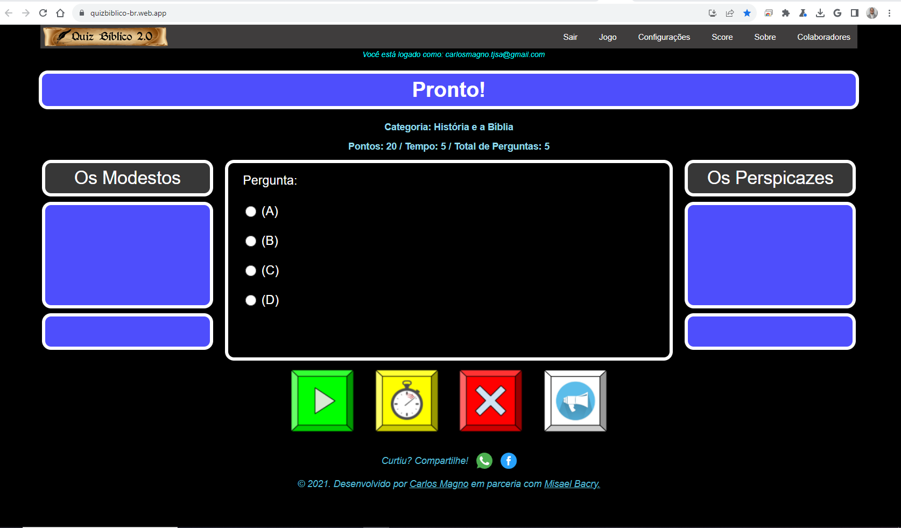
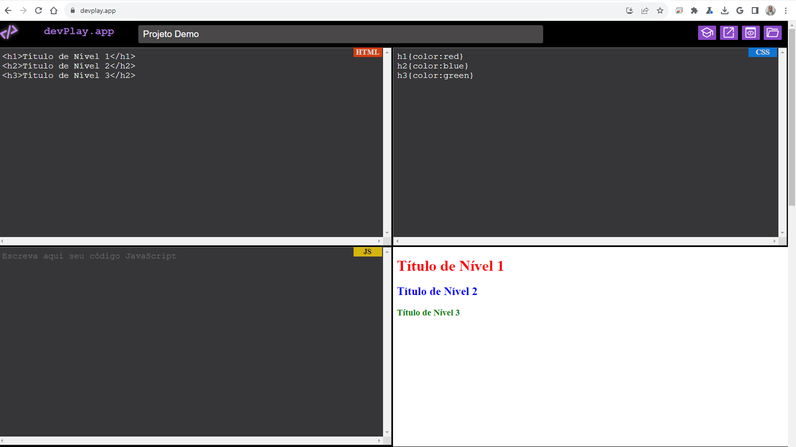

<!--
- 🔭 I’m currently working on ...
- 🌱 I’m currently learning ...
- 👯 I’m looking to collaborate on ...
- 🤔 I’m looking for help with ...
- 💬 Ask me about ...
- 📫 How to reach me: ...
- 😄 Pronouns: ...
- ⚡ Fun fact: ...
-->
# **Carlos Magno**
💼 Ocupação: Ministro Religioso em tempo integral das Testemunhas de Jeová  
✍ Hobbies: Escrita, Programação, Edição de Vídeos  
📍 Naturalidade: Goiana, Pernambuco, Brasil

 

***

 
          

       
  

         
         
         

***
## **Projetos publicados**

* <a href="https://quizbiblico-br.web.app/">quizbiblico-br.web.app</a>  
          * <spam> Jogo online de perguntas e respostas com banco de dados que desenvolvi na época da pandemia para brincar com os amigos. Meu primeiro projeto em desenvolvimento WEB.</spam> 
* <a href="https://devplay.app/">devplay.app</a>  
          * <spam>Aplicação para praticar desenvolvimento WEB com HTML, CSS e JavaCript, vendo o resultado ao vivo e armazenando os snippets de código no navegador. Meu segundo projeto em desenvolvimento WEB.</spam>
  
* <a href="https://carlosmagno.github.io/">carlosmagno.github.io</a>   
          * <spam>Site autoral onde publiquei meus poemas para a família e amigos, e links para os projetos concluídos. Terceiro projeto. Feito de modo simples.</spam> 

## **Telas**
### **Quiz Bíblico Web**
 
### **devPlay.app**
 

